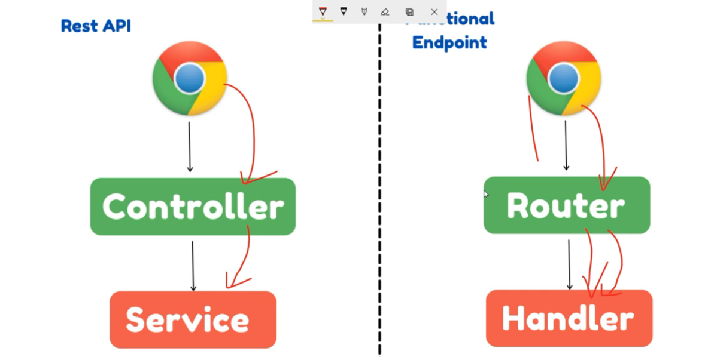

In REST API, request reach to controller and then service.

In Functional endpoint, request goes to router, and it redirects that request to corresponding
handler.

To implement Spring Reactive, create router and handler folder.

In RouterConfig, create a router function with return type RouterFunction<ServerResponse>

http://localhost:8080/customers/reactive-stream

this flow is synchronous and blocking because the response is a list of object

{"id":10,"name":"customer10"}
12:35:52.520
{"id":9,"name":"customer9"}
12:35:51.523
{"id":8,"name":"customer8"}
12:35:50.508
{"id":7,"name":"customer7"}
12:35:49.495
{"id":6,"name":"customer6"}
12:35:48.487
{"id":5,"name":"customer5"}
12:35:47.480
{"id":4,"name":"customer4"}
12:35:46.461
{"id":3,"name":"customer3"}
12:35:45.448
{"id":2,"name":"customer2"}
12:35:44.436
{"id":1,"name":"customer1"}

But, if we return as stream rather the JSON object, then publisher keep on emit the event to the subscriber.

Now, how to configure the publisher to send event instead of object.
It is possible with help of content type. refer this endpoint in class

http://localhost:8080/customers/reactive-stream

// if we skip the contentType(MediaType.TEXT_EVENT_STREAM), then data send as an object
// If we use it, then response show as an event or stream
.contentType(MediaType.TEXT_EVENT_STREAM) 

and the response id asynchronous and non-blocking

means thread executes the code, interacts with database and keep fetching data on the console 
without wait on other thread.

each flow of thread object, there is onNext(), so we get asynchronous response.

{"id":10,"name":"customer10"} (console) processing count in stream flow : 10 (database)
12:45:43.197
{"id":9,"name":"customer9"} (console) processing count in stream flow : 9 (database)
12:45:42.169
{"id":8,"name":"customer8"} (console) processing count in stream flow : 8 (database)
12:45:41.157
{"id":7,"name":"customer7"} (console) processing count in stream flow : 7 (database)
12:45:40.144
{"id":6,"name":"customer6"} (console) processing count in stream flow : 6 (database)
12:45:39.140
{"id":5,"name":"customer5"} (console) processing count in stream flow : 5 (database)
12:45:38.137
{"id":4,"name":"customer4"} (console) processing count in stream flow : 4 (database)
12:45:37.110
{"id":3,"name":"customer3"} (console) processing count in stream flow : 3 (database)
12:45:36.105
{"id":2,"name":"customer2"} (console) processing count in stream flow : 2 (database)
12:45:35.101
{"id":1,"name":"customer1"} (console) processing count in stream flow : 1 (database)

Total execution time : 5(less than the blocking call)

